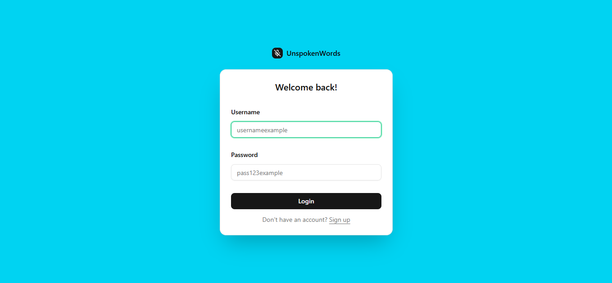
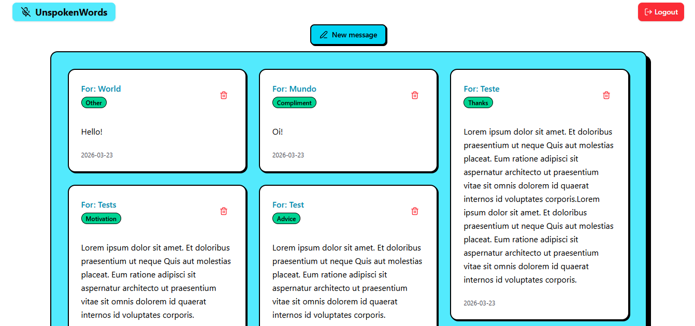
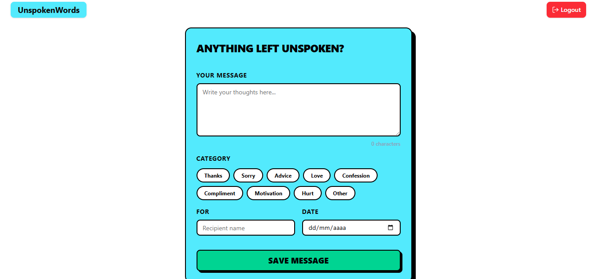

# 📝 Unspoken Words

A secure web application where users can anonymously write and store messages they never said. Built with modern web technologies, featuring JWT authentication and a clean, intuitive interface.

## ✨ Features

- 🔐 **Secure Authentication**: JWT-based authentication with HttpOnly cookies
- 📝 **Message Management**: Create, view, and delete personal messages
- 🏷️ **Categorization**: Organize unspoken words by categories
- 🎨 **Modern UI**: Clean, responsive design with Tailwind CSS
- 🐳 **Containerized**: Full Docker support for easy deployment
- 🔒 **Privacy-First**: Messages are stored securely and privately

## 🛠️ Tech Stack

### Backend
- **Java 21** - Modern Java runtime
- **Spring Boot 4.0.2** - Web framework
- **Spring Security** - Authentication and authorization
- **JPA/Hibernate** - ORM for database operations
- **PostgreSQL** - Primary database
- **Flyway** - Database migrations
- **JWT (Auth0)** - Token-based authentication
- **Lombok** - Code generation

### Frontend
- **Next.js 16** - React framework
- **React 19** - UI library
- **TypeScript** - Type-safe JavaScript
- **Tailwind CSS** - Utility-first CSS framework
- **Radix UI** - Accessible UI components
- **Lucide React** - Icon library
- **Axios** - HTTP client

### DevOps
- **Docker & Docker Compose** - Containerization
- **PostgreSQL** - Database
- **Maven** - Java dependency management
- **pnpm** - Node.js package manager

## 📋 Prerequisites

Before running this application, make sure you have the following installed:

- **Docker & Docker Compose** (recommended for easy setup)
- **Java 21** (for local backend development)
- **Node.js 18+** (for local frontend development)
- **pnpm** (for frontend package management)

## 🚀 Quick Start with Docker

1. **Clone the repository**
   ```bash
   git clone <repository-url>
   cd unspoken-words
   ```

2. **Start backend and database**
   ```bash
   docker-compose up --build
   ```

3. **Run frontend**
   ```bash
   cd frontend
   pnpm install
   pnpm dev
   ```

4. **Access the application**
   - Frontend: http://localhost:3000
   - Backend API: http://localhost:8080

The application will automatically set up PostgreSQL database and run migrations for the backend.

## 🏃‍♂️ Local Development Setup

### Backend Setup

1. **Navigate to backend directory**
   ```bash
   cd backend
   ```

2. **Set up environment variables**
   Copy the `.env` file from the root directory or create your own with the required variables.

3. **Start PostgreSQL** (using Docker)
   ```bash
   docker run --name postgres -e POSTGRES_DB=unspokenwords -e POSTGRES_USER=postgres -e POSTGRES_PASSWORD=postgres -p 5432:5432 -d postgres:18
   ```

4. **Run the backend**
   ```bash
   ./mvnw spring-boot:run
   ```

### Frontend Setup

1. **Navigate to frontend directory**
   ```bash
   cd frontend
   ```

2. **Install dependencies**
   ```bash
   pnpm install
   ```

3. **Start development server**
   ```bash
   pnpm dev
   ```

## 📸 Screenshots

### Login Page


### My Unspoken Words


### New Message


## 📚 API Documentation

### Authentication Endpoints

| Method | Endpoint       | Description          | Body                     |
|--------|----------------|----------------------|--------------------------|
| POST   | `/auth/login`  | User login           | `{email, password}`     |
| POST   | `/auth/signup` | User registration    | `{email, password, name}`|
| POST   | `/auth/logout` | User logout          | -                        |

### Message Endpoints

| Method | Endpoint          | Description          | Body/Authorization |
|--------|-------------------|----------------------|-------------------|
| POST   | `/messages`       | Create new message   | `{content, category}` + JWT |
| GET    | `/messages`       | Get user's messages  | JWT required     |
| DELETE | `/messages/{id}`  | Delete message       | JWT required     |

### Authentication
All message endpoints require JWT authentication. Include the JWT token in the `Authorization` header:
```
Authorization: Bearer <your-jwt-token>
```

## 🧪 Testing

### Backend Tests
Backend tests run with the dedicated Docker compose test stack:
```bash
docker-compose -f docker-compose.test.yml up --build --abort-on-container-exit
```

### Frontend Tests
```bash
cd frontend
pnpm test
```

## 🤝 Contributing

1. Fork the repository
2. Create a feature branch (`git checkout -b feature/amazing-feature`)
3. Commit your changes (`git commit -m 'Add amazing feature'`)
4. Push to the branch (`git push origin feature/amazing-feature`)
5. Open a Pull Request

##  Author

**Alisson T. Fraga** - [GitHub](https://github.com/alissontfraga)

## 🙏 Acknowledgments

- Built with ❤️ using Spring Boot and Next.js
- UI components powered by Radix UI and Tailwind CSS
- Icons from Lucide React


